# Food Delivery App
<<<< Progetto esame PDMIU (S.I. 2023/2024)
=======

Nunzio D'Amore, Mat.329163

## In breve

Il presente progetto ha come obiettivo quello di creare un'app di ordinazione online di un ristorante generico.
L'app permette ai clienti del ristorante di effettuare le ordinazioni, scegliendo i prodotti che più preferiscono; e permette al ristorante di gestire questi prodotti e gli ordini effettuati dai clienti.

## Casi d'uso
I casi d'uso di FDA sono visualizzati nel seguente diagramma.

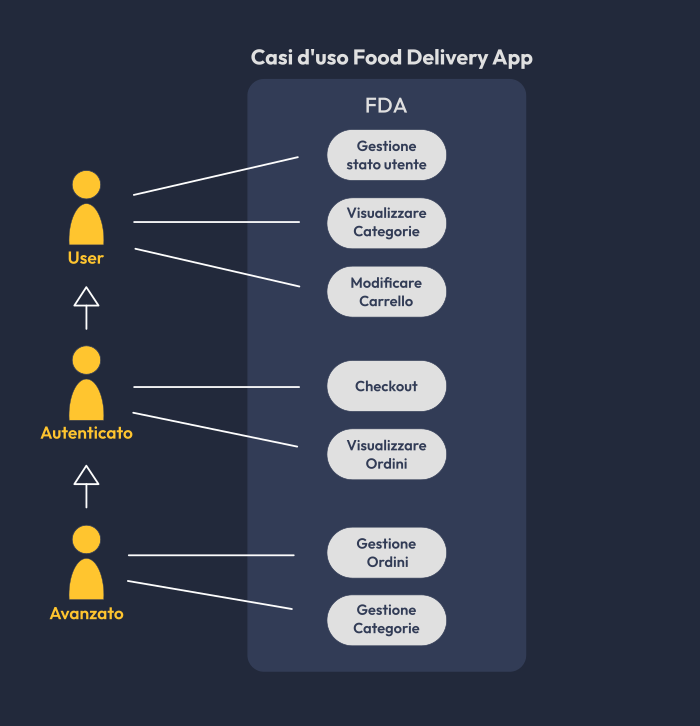

## UX e UI

L'app è state progettata per rendere l'esperienza utente più semplice ma allo stesso tempo piacevole possibile, aggiungendo animazioni e transizioni che rendono l'UI fluida e reattiva.

### UX
Per migliorare la user experience l'interfaccia è stata progettata per fornire sempre un feedback all'utente, anche corredandola con animazioni di caricamento, tramite il widget FdaLoading. Questo ricopre il widget figlio con un'animazione di caricamento che disabilita ogni input. Mostra eventualmente anche un testo, che è possibile modificare dinamicamente.

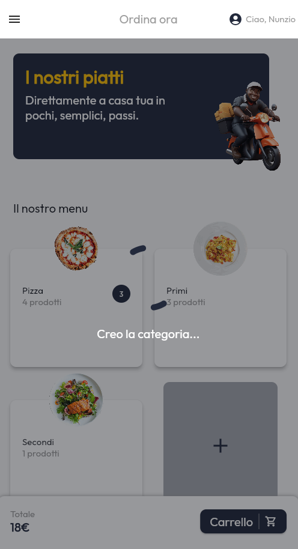

Con lo stesso obiettivo, l'interazione con l'utente viene corredata con dialog che informano l'utente di un qualsiasi evento (di errore e non).

Per facilitare l'ordinazione i prodotti vengono divisi in categorie, dove per ogniuna viene indicato il numero di prodotti inseriti nel carrello.

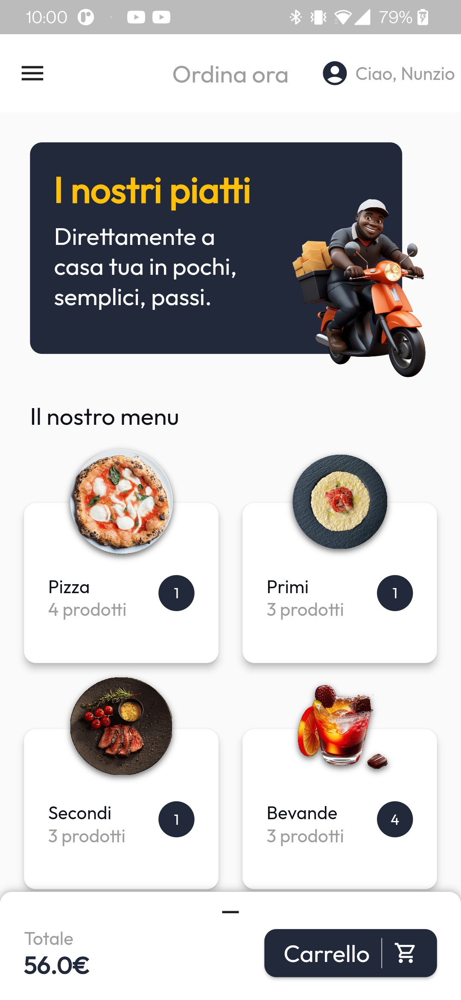

Per permettere al cliente di scegliere consapevolmente, ogni prodotto sarà affiancato da una foto, e ne verranno mostrati tutti i dettagli. 

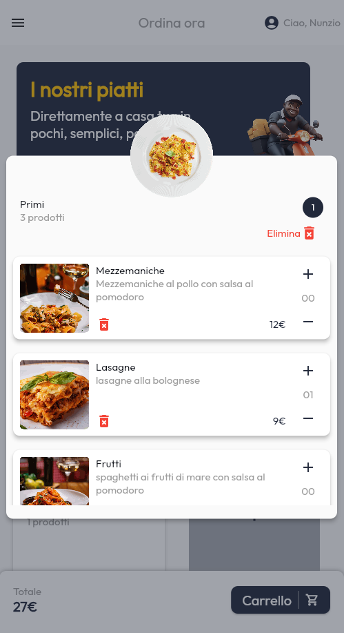

Ogni ordine effettuato dall'utente sarà visibile nella sezione apposita "I miei ordini". Da qui l'utente potrà controllare in tempo reale lo stato dei suoi ordini e visualizzarne i dettagli.
I miei ordini            |  Dettagli ordine
:-------------------------:|:-------------------------:
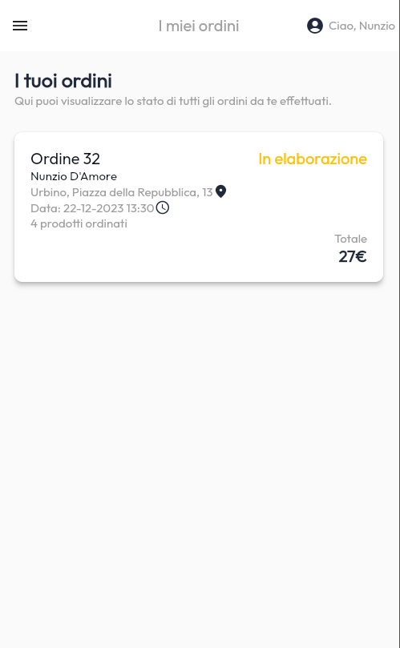  |  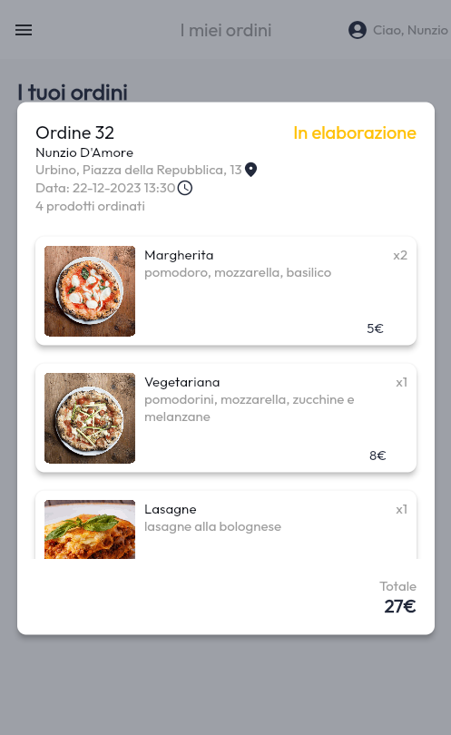

Nella pagina di checkout l'utente potrà anche scegliere tra gli indirizzi precedentemente usati per velocizzarne il processo.

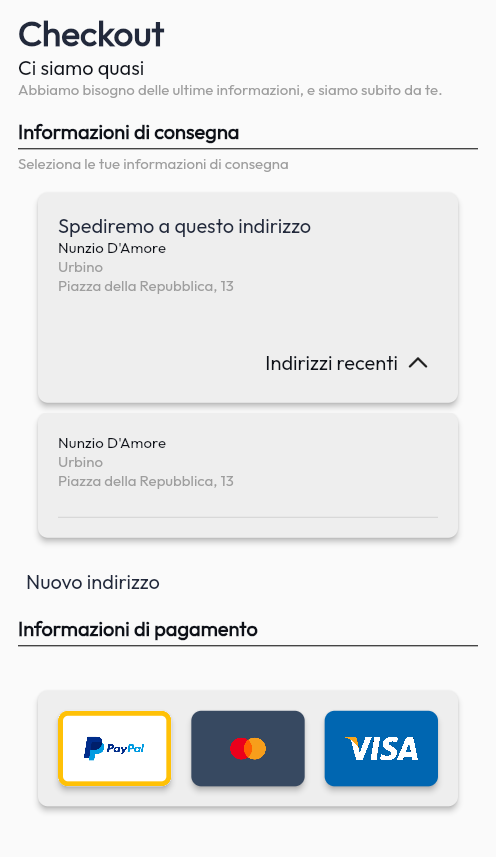

### Adattabilità UI
L'UI è stata progettata per adattarsi a qualsiasi schermo, di qualsiasi dimensione e in qualsiasi orientamento.
Per farlo si è usufruito degli strumenti base di flutter, ma sono stati implementati anche widget dinamici come DynamicGridView che si basa su Wrap, in grado di adattare una lista di widget alla larghezza attuale dello schermo, incastrandoli nel miglior modo possibile rispettando i limiti imposti.

O ancora la pagina di checkout è stato implementato un sistema di adattamento matematico che di adatta fluidamente al variare della dimensione della schermata.

Checkout largo            |  Checkout stretto 
:-------------------------:|:-------------------------:
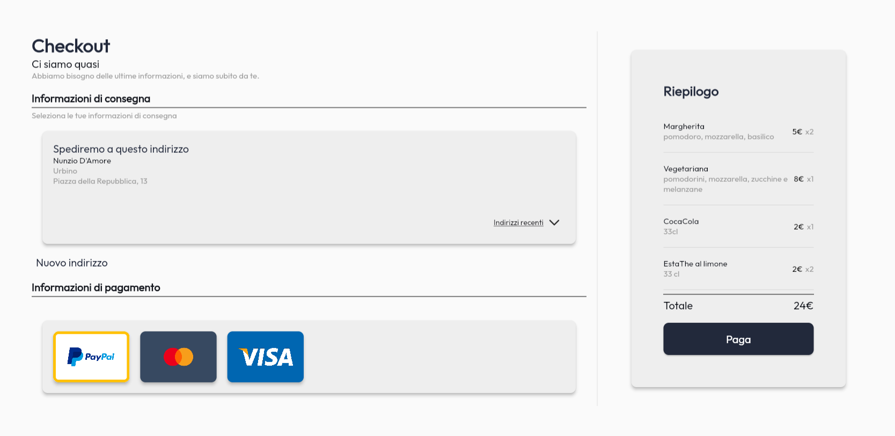  |  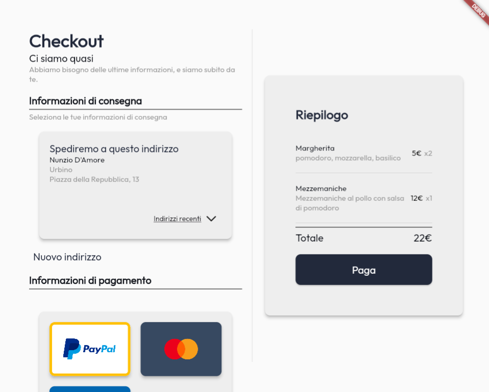

A questo aspetto contribuisce ampiamente anche il widget SideMenuView che inserisce un menu a scomparsa laterale, permettendo sia di navigare tra diverse pagine che di effettuare delle azioni.
Questo widget si adatta dinamicamente a seconda che lo schermo sia in orizzontale o verticale. Come comportamento di default in caso di visuale orizzontale, il menu resta fisso al lato sinistro dello schermo.

Menu in verticale chiuso   |  Menu in verticale aperto
:-------------------------:|:-------------------------:
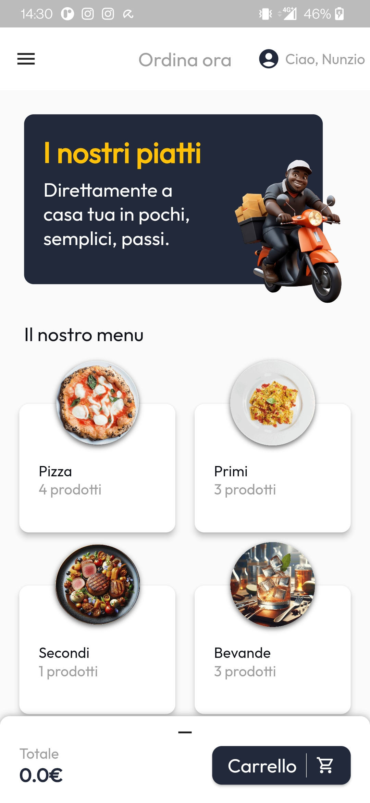  |  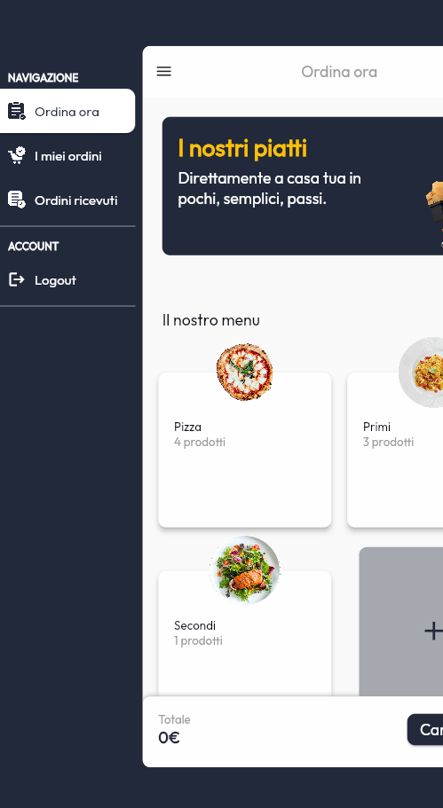 

**Menu in orizzontale**
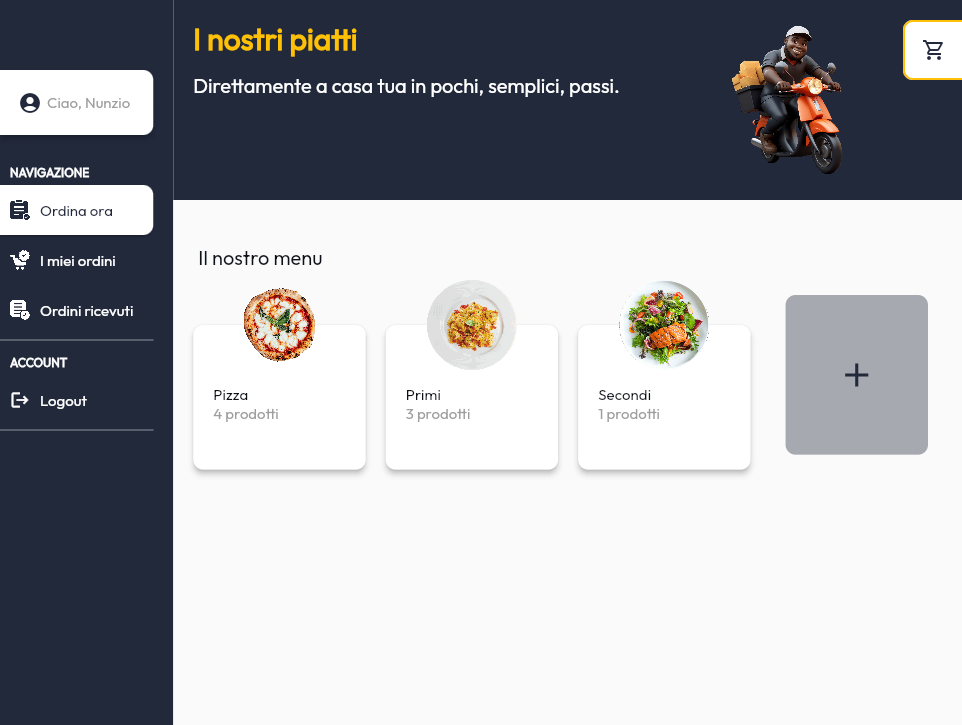 

Nelle immagini precedenti si può anche notare il widget TotalAndConfirm che permette di visualizzare il totale in denaro, dei prodotti selezionati e su richiesta il carrello. Anche questo si adatta a seconda che lo spazio in cui viene visualizzato sia orizzontale o verticale. In caso di visualizzazione verticale viene mostrato il pulsante carrello che permette - attraverso un animazione di entrata a scorrimento dal basso verso l'alto - di visualizzare il carrello.
Mentre, in caso di visualizzazione orizzontale viene mostrato un pulsante in alto a destra dello schermo (raffigurante un carrello) che permette - attraverso un animazione di entrata a scorrimento da destra verso sinistra - di visualizzare il carrello.

Carrello verticale            |  Carrello orizzontale
:----------------------:|:-------------------------:
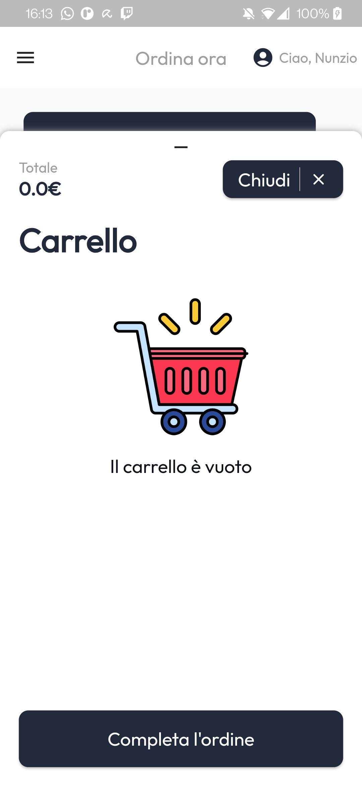  |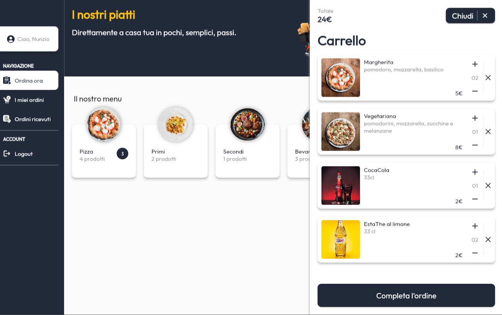

### Risoluzione limiti di Hero

Quasi tutte le transizioni tra pagine sono state animate tramite Hero, per garantire un collegamento logico e visivo tra tutte le azioni dell'utente, migliorandone la UX. Hero ha però un limite: non possono esserci discendenze tra widget Hero. Per garantire consistenza nella UI e UX è stato quindi creato un ulteriore widget per ovviare a questo problema: ZoomableImage.

Questo widget richiama una pagina "ponte" che visualizza l'immagine specificata nella posizione esatta in cui era ZoomableImage sovrapponendola, e avvia successivamente la navigazione verso la pagina di visualizzazione delle immagini tramite un Hero widget.
Resta in attesa della pagina di visualizzazione e quando questa viene chiusa, torna automaticamente alla pagina chiamante.
Il problema viene risolto poichè le nuove pagine non sono discendenti delle pagine chiamanti nell'albero dei widget.

## Tecnologie 
### Gestione dello stato
L'applicazione usa Bloc per la gestione dello stato alternando sia bloc che cubit in base alle necessità.
Inoltre, si è cercato per quanto possibile di annidare i widget in ascolto dello stato, ottimizzando le performance generali.

### Architettura
L'architettura dell'applicazione è divisa in tre parti fondamentali:
* bloc/cubit: controller dell'applicazione che gestisce lo stato dell'app
* Data che a sua volta è diviso in:
    * Model: la descrizione di tutti i dati gestiti dall'app
    * APIs: utile per la comunicazione con le API lato server
    * Repositories: ponte nella comunicazione tra bloc e le API, ma anche nella gestione dei dati in locale
* Presentation: si occupa della visualizzazione dello stato dell'app

Questa architettura risulta essere molto simile allo standard model-controller-view - il quale è stato integrato con bloc - rendendo l'applicazione facilmente mantenibile, scalabile e testabile, aumentandone la stabilità.

### Persistenza dei dati e backend
La persistenza delle informazioni è garantita sia localmente tramite SharedPreferences (il carrello se l'utente non ha effettuato l'accesso ed user e le credenziali), sia salvando informazioni sul database nel caso in cui l'utente fosse loggato.
Per farlo, l'app comunica con il backend - interamente scritto in PHP - tramite richieste http.

La comuniazione è divisa in tre strati logici:

* Bloc, acquisisce ed riconosce l'evento generato dall'utente o da timer, per poi effettuare la richiesta al repository. In base alla risposta di quest'ultimo verrà generato un nuovo stato.
* Il repository, è l'oggetto che si occupa di comunicare con le API e di trasformare le risposte di queste in dati riconoscibili dall'app, insanziando gli oggetti delle classi che compongono il model.
Si occupa, inoltre, di salvare e recuperare i dati in locale.
* Le API sono classi statiche che si occupano di comunicare con il backend effettuando richieste http.

Tutti i codici di errore del backend sono contenuti - sottoforma di mappa - nella classe ErrorCodes.

### Gestione delle immagini
Le immagini vengono sempre convertite in png con una risoluzione che non supera il FHD prima dell'invio, per ottimizzare i tempi di caricamento e il consumo dati. Inoltre, qualora dovesse essere specificato, il backend provvede anche ad una conversione della profondità a 8 bit per garantire la trasparenza durante la visualizzazione delle immagini tramite NetworkImage.

Le immagini vengono inoltre visualizzate tramite il widget FdaCachedNetworkImage che provvederà a visualizzare l'immagine tramite il widget CachedNetworkImage, mostrando un'animazione di caricamento e salvando le immagini in cache, evitando di riscaricare ripetutamente le immagini.

### Resilienza a perdite di connessione
L'app è stata progettata per resistere a perdite di connessione, recuperando l'attività e lo stato non appena una connessione internet torna ad essere disponibile e attiva.

### Package
L'applicazione usufruisce di vari package aggiuntivi per la gestione di diversi aspetti interni:

* google_fonts: per utilizzare i font forniti da google.
* flutter_bloc: Bloc
* cross_file: utilizzata per la gestione dei file (le immagini) su piattaforme diverse
* mime: verifica del tipo del file recuperato
* gap: permette di generare uno spazio (gap) nelle righe/colonne. Equivalente ad inserire un SizedBox ma senza la necessità di sapere in quale widget viene inserito.  
* image_picker: utilizzato per recuperare le immagini da caricare.
* photo_view: utile per visualizzare le immagini a schermo intero
* cached_network_image: recupera le immagini dalla rete, salvandole in cache
* loading_animation_widget: utilizzado in FdaLoading per l'animazione di caricamento
* shared_preferences: salvataggio di dati in locale (carrello e credenziali)
* connectivity_plus: utilizzato per ascoltare eventi di connettività
* auto_size_text: permette di creare un widget testuale che adatta la grandezza del font in base allo spazio a sua disposizione.