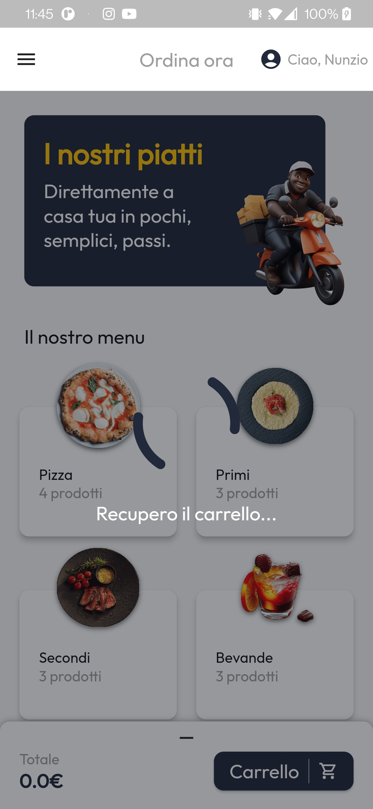
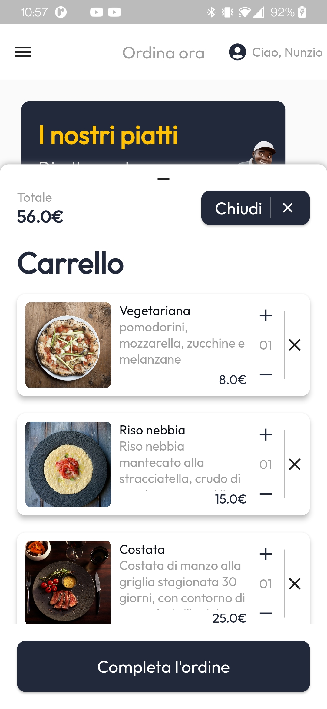
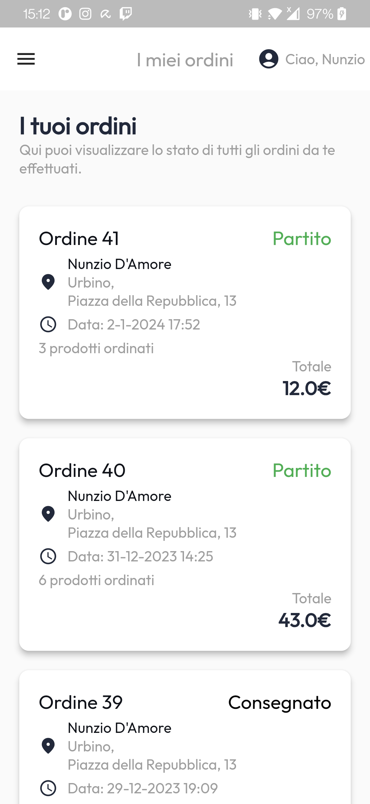
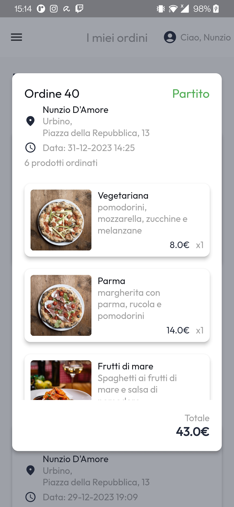
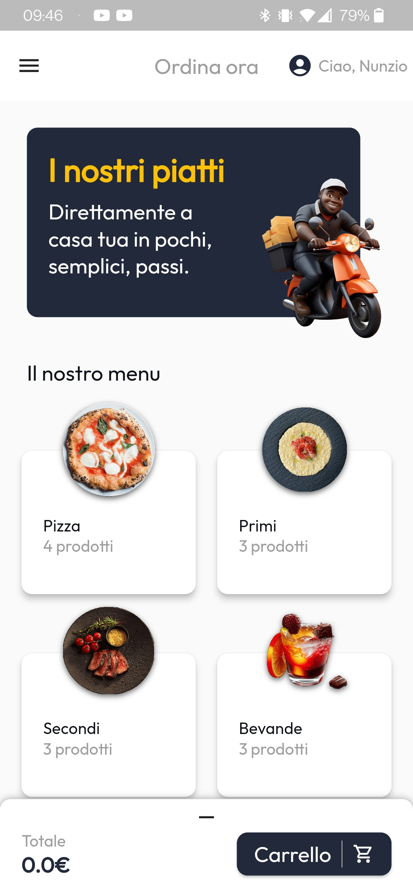
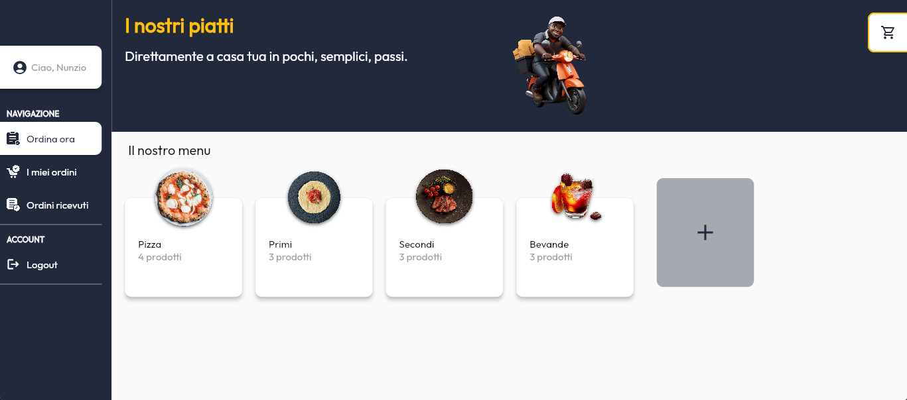

# Food Delivery App
<<<< Progetto esame PDMIU (S.I. 2023/2024)
=======

Nunzio D'Amore, Mat.329163

## In breve

Il presente progetto ha come obiettivo quello di creare un app di ordinazione online di un ristorante.
L'app permette ai clienti del ristorante di effettuare le ordinazioni, scegliendo i prodotti che più preferiscono e permette al ristorante di gestire questi prodotti e gli ordini effettuati dai clienti.

## Casi d'uso
I casi d'uso di FDA sono visualizzati nel seguente diagramma.

## UX e UI

L'app è stata progettata per rendere l'esperienza utente più semplice ma allo stesso tempo piacevole possibile, aggiungendo animazioni e transizioni che rendono l'UI fluida e reattiva.

### UX
Per migliorare la user experience - secondo il principio di reattività - l'interfaccia è stata progettata per fornire sempre un feedback all'utente, corredandola con animazioni di caricamento - tramite il widget FdaLoading - e dialoghi che informano l'utente su un qualsiasi evento (di errore e non). 

FdaLoading ricopre il widget figlio con un'animazione di caricamento che disabilita ogni input. Mostra eventualmente anche un testo, che è possibile modificare dinamicamente.

Loading            |  Dialogo
:-------------------------:|:-------------------------:
 | 

Seguendo la legge di Miller, si è cercato di semplificare più possibile l'interfaccia, limitando il numero di informazioni contemporaneamente visibili sullo schermo.

A tale scopo, i prodotti sono stati divisi in categorie: questo rende i prodotti facilmente rintracciabili; permette di avere una visione generica di ciò che si sta facendo; e questa suddivisione gerarchica permette solo su richiesta di visualizzare i dettagli di ogni categoria di prodotto.

Il flusso dell'ordinazione è il seguente:
1. Scelta dei prodotti 
2. Checkout
3. Controllo dello stato dell'ordine

### Scelta dei prodotti 
Come preannunciato, per facilitare l'ordinazione, i prodotti vengono divisi in categorie, dove per ognuna viene indicato il numero di prodotti inseriti nel carrello.

Per permettere al cliente di scegliere consapevolmente, ogni prodotto sarà affiancato da una foto, e ne verranno mostrati tutti i dettagli. 

Il carrello permette all'utente di avere una visuale generale su tutti i prodotti che sta per ordinare e continuare a modificarne il contenuto.

### Checkout

La schermata di checkout permette all'utente di selezionare o inserire l'indirizzo che preferisce (anche tra quelli precedentemente usati), scegliere il metodo di pagamento e di visualizzare un riepilogo prima di concludere l'ordine.

### Controllo dello stato dell'ordine

Ogni ordine effettuato dall'utente sarà visibile nella sezione apposita "I miei ordini". Da qui l'utente potrà controllare in tempo reale lo stato dei suoi ordini e visualizzarne i dettagli.
I miei ordini            |  Dettagli ordine
:-------------------------:|:-------------------------:
  |  

### Utente avanzato
Un utente con permessi protrà, inoltre, visualizzare e gestire - nell'apposita schermata "Ordini ricevuti" - tutti gli ordini in arrivo dai clienti.
La gestione dell'ordine consiste nella possibilità di cambiare lo stato dell'ordine scegliendolo tra: "In elaborazione", "Partito", "Consegnato" e "Annullato".

Ordini ricevuti           |  Modifica stato ordine
:-------------------------:|:-------------------------:
  |  

### Adattabilità UI
La UI è stata progettata per adattarsi a qualsiasi schermo, di qualsiasi dimensione e in qualsiasi orientamento.
Per farlo si è usufruito degli strumenti base di flutter, ma sono stati implementati anche widget dinamici come [DynamicGridView](https://github.com/NunzioDA/food_delivery_app/blob/main/lib/Presentation/UIUtilities/dynamic_grid_view.dart) che si basa su Wrap, in grado di adattare una lista di widget alla larghezza attuale dello schermo, incastrandoli nel miglior modo possibile rispettando i limiti imposti (l'effetto è visibile successivamente nelle immagini raffiguranti il menu in verticale/orizzontale, dove si vede come le categorie di prodotti si adattano alla schermata).

O ancora, per la pagina di checkout è stato implementato un sistema di adattamento matematico che si adatta fluidamente al variare della dimensione della schermata. Questo fa in modo che per schermate larghe la sezione di raccolta delle informazioni prenda due terzi della schermata, mentre per schermate strette ci sia una divisione del 50 e 50.

Checkout largo            |  Checkout stretto 
:-------------------------:|:-------------------------:
|  

A questo aspetto contribuisce ampiamente anche il widget SideMenuView che inserisce un menu a scomparsa laterale, permettendo sia di navigare tra diverse pagine che di effettuare delle azioni.
Questo widget si adatta dinamicamente a seconda che lo schermo sia in orizzontale o verticale. Come comportamento di default in caso di visuale orizzontale, il menu resta fisso al lato sinistro dello schermo.

Menu in verticale chiuso   |  Menu in verticale aperto
:-------------------------:|:-------------------------:
  |   

**Menu in orizzontale**

Nelle immagini precedenti si può anche notare il widget [TotalAndConfirm](https://github.com/NunzioDA/food_delivery_app/blob/main/lib/Presentation/ModelVisualizzation/Cart/total_and_confirm.dart) che permette di visualizzare il totale in denaro dei prodotti selezionati, e su richiesta il carrello. Anche questo si adatta a seconda che lo spazio in cui viene visualizzato sia orizzontale o verticale. In caso di visualizzazione verticale viene mostrato il pulsante carrello che permette - attraverso un'animazione di entrata a scorrimento dal basso verso l'alto - di visualizzare il carrello.
Mentre, in caso di visualizzazione orizzontale viene mostrato un pulsante in alto a destra dello schermo (raffigurante un carrello) che permette - attraverso un'animazione di entrata a scorrimento da destra verso sinistra - di visualizzare il carrello.

Carrello verticale            |  Carrello orizzontale
:----------------------:|:-------------------------:
  |

### Risoluzione limiti di Hero

Quasi tutte le transizioni tra pagine sono state animate tramite Hero, per garantire un collegamento logico e visivo tra tutte le azioni dell'utente, migliorandone la UX. Hero ha però un limite: non possono esserci discendenze tra widget Hero. Per garantire consistenza nella UI e UX è stato quindi creato un ulteriore widget per ovviare a questo problema: [SuperHero](https://github.com/NunzioDA/food_delivery_app/blob/main/lib/Presentation/UIUtilities/super_hero.dart).

SuperHero richiama una pagina "ponte" (senza opacità) che visualizza il figlio sovrapponendolo visivamente al SuperHero chiamante, e avvia successivamente la navigazione verso la pagina specificata, tramite l'animazione Hero.
Resta in attesa della pagina e quando questa viene chiusa, torna automaticamente alla pagina chiamante (restituendone anche l'eventuale risultato).
Il problema viene risolto poiché  le nuove pagine non sono discendenti delle pagine chiamanti nell'albero dei widget.

Ovviamente, il widget viene utilizzato solo dove strettamente necessario.

## Tecnologie 
### Gestione dello stato
L'applicazione usa Bloc per la gestione dello stato, alternando sia bloc che cubit in base alle necessità.
Inoltre, si è cercato per quanto possibile di annidare i widget in ascolto dello stato, aggiornando solo i widget necessari - come per il widget [AddRemove](https://github.com/NunzioDA/food_delivery_app/blob/main/lib/Presentation/UIUtilities/add_remove_selector.dart) (usato per aggiungere e rimuovere prodotti dal carrello) che costruisce al suo interno un BlocConsumer, solo per il widget testuale che deve essere aggiornato (quando necessario) nel momento in cui il bloc specificato restituisce un nuovo stato.

### Architettura
L'architettura dell'applicazione è divisa in tre parti fondamentali:
* bloc/cubit: controller dell'applicazione che gestisce lo stato dell'app
* Data che a sua volta è diviso in:
    * Model: la descrizione di tutti i dati gestiti dall'app
    * APIs: utile per la comunicazione con le API lato server
    * Repositories: traduttore nella comunicazione tra bloc e le API, trasformando le risposte delle API nei dati descritti nel model e viceversa, ma si occupa anche nella gestione dei dati salvati in locale sul dispositivo.
* Presentation: si occupa della visualizzazione dello stato dell'app, tramite widget generici o pagine.

Questa architettura è un adattamento dello standard model-controller-view - il quale è stato integrato con bloc - rendendo l'applicazione facilmente mantenibile, scalabile e testabile, aumentandone la stabilità.

### Persistenza dei dati e backend
La persistenza delle informazioni è garantita sia localmente tramite SharedPreferences (il carrello, in caso l'utente non si sia ancora autenticato e le credenziali di mantenimento della sessione, in caso di utente autenticato), sia salvando informazioni sul database nel caso in cui l'utente fosse loggato.
Per farlo, l'app comunica con il [backend](https://github.com/NunzioDA/backendFda) - interamente scritto in PHP - tramite richieste http. L'indirizzo del server è specificato nella variabile d'ambiente BACKEND.

La comunicazione è divisa in tre strati logici:

* Bloc, acquisisce ed riconosce l'evento generato dall'utente o da timer, per poi effettuare la richiesta al repository. In base alla risposta di quest'ultimo verrà generato un nuovo stato.
* Il repository, è l'oggetto che si occupa di comunicare con le API e di trasformare le risposte di queste in dati riconoscibili dall'app, instanziando gli oggetti delle classi che compongono il model.
* Le API sono classi statiche che si occupano di comunicare con il backend effettuando richieste http.

Tutti i codici di errore del backend sono contenuti - sottoforma di mappa - nella classe ErrorCodes.

### Gestione delle immagini
Le immagini vengono sempre convertite in png; con una risoluzione che non supera il FHD prima dell'invio, per ottimizzare i tempi di caricamento e il consumo dati. Inoltre, qualora dovesse essere specificato, il backend provvede anche ad una conversione della profondità a 8 bit, per garantire la trasparenza durante la visualizzazione delle immagini tramite CachedNetworkImage.

Le immagini vengono visualizzate tramite il widget FdaCachedNetworkImage; il quale si basa sul widget CachedNetworkImage, settando delle impostazioni di base e mostrando un'animazione di caricamento. CachedNetwordImage permette di salvare le immagini in cache senza la necessità di riscaricare continuamente le immagini, risparmiando consumo dati e velocizzando la visualizzazione delle immagini.

### Resilienza a perdite di connessione
L'app è stata progettata per resistere a perdite di connessione, recuperando l'attività e lo stato non appena una connessione internet torna ad essere disponibile e attiva.

### Piattaforme
L'app è stata testata ed esportata per android e web, ma non ha particolari limitazioni che non permettono di usufruirne tramite altre piattaforme.

Per il web l'applicazione viene esportata utilizzando il web renderer canvaskit per permettere una fluidità maggiore durante le animazioni e della UI in generale (anche se a discapito della memoria occupata).

### Package
L'applicazione usufruisce di vari package aggiuntivi per la gestione di diversi aspetti interni:

* google_fonts: per utilizzare i font forniti da google.
* flutter_bloc: Bloc per la gestione dello stato
* cross_file: utilizzata per la gestione dei file (le immagini) su piattaforme diverse
* mime: verifica del tipo del file recuperato
* gap: permette di generare uno spazio (gap) nelle righe/colonne. Equivalente ad inserire un SizedBox ma senza la necessità di sapere in quale widget viene inserito.  
* image_picker: utilizzato per recuperare le immagini dal file system.
* photo_view: utile per visualizzare le immagini a schermo intero
* cached_network_image: recupera le immagini dalla rete, salvandole in cache
* loading_animation_widget: utilizzato in FdaLoading per l'animazione di caricamento
* shared_preferences: salvataggio di dati in locale (carrello e credenziali)
* connectivity_plus: utilizzato per ascoltare eventi di connettività
* auto_size_text: permette di creare un widget testuale che adatta la grandezza del font in base allo spazio a sua disposizione.