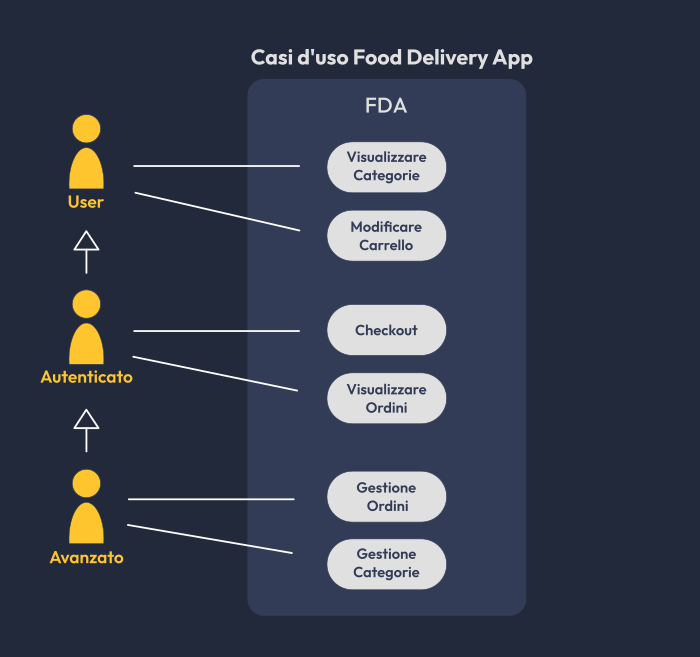
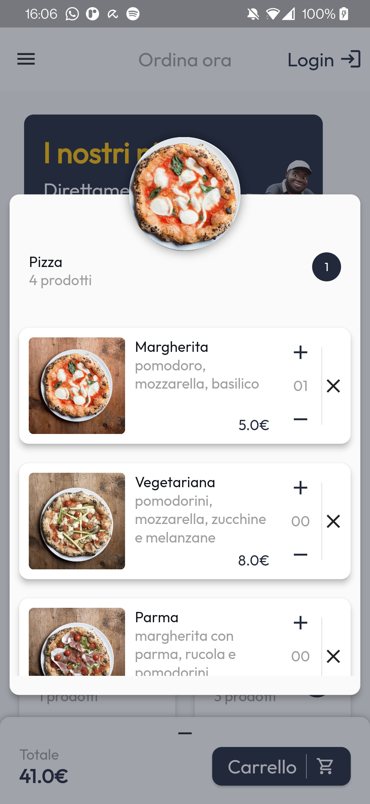
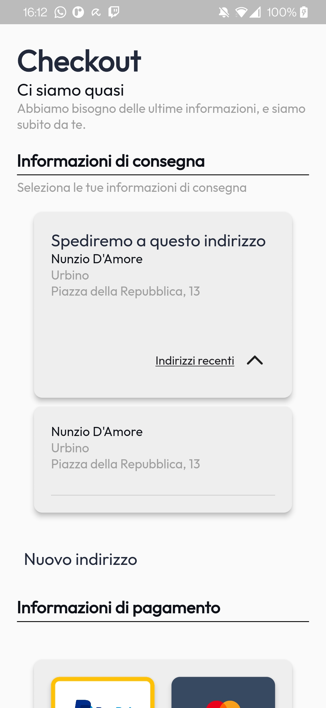
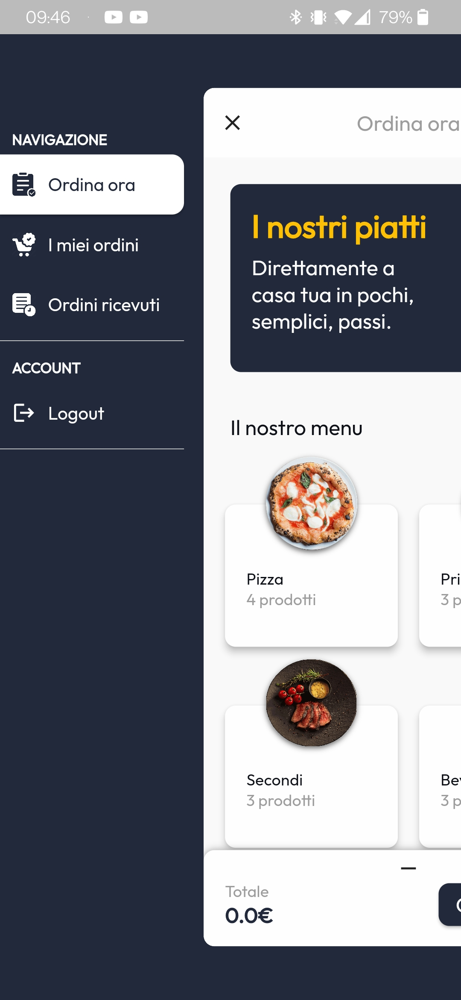
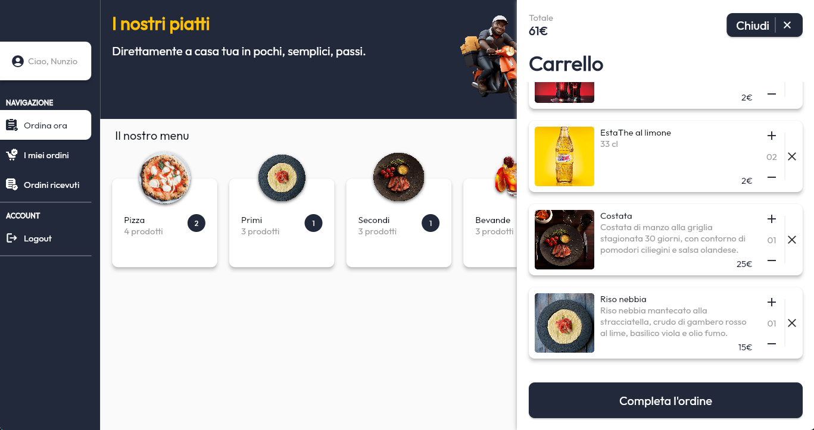

# Food Delivery App
<<<< Progetto esame PDMIU (S.I. 2023/2024)
=======

Nunzio D'Amore, Mat.329163

## In breve

Il presente progetto ha come obiettivo quello di creare un'app di ordinazione online di un ristorante generico.
L'app permette ai clienti del ristorante di effettuare le ordinazioni, scegliendo i prodotti che più preferiscono; e permette al ristorante di gestire questi prodotti e gli ordini effettuati dai clienti.

## Casi d'uso
I casi d'uso di FDA sono visualizzati nel seguente diagramma.

## UX e UI

L'app è state progettata per rendere l'esperienza utente più semplice ma allo stesso tempo piacevole possibile, aggiungendo animazioni e transizioni che rendono l'UI fluida e reattiva.

### UX
Per migliorare la user experience l'interfaccia è stata progettata per fornire sempre un feedback all'utente, anche corredandola con animazioni di caricamento, tramite il widget FdaLoading. Questo ricopre il widget figlio con un'animazione di caricamento che disabilita ogni input. Mostra eventualmente anche un testo, che è possibile modificare dinamicamente.

Con lo stesso obiettivo, l'interazione con l'utente viene corredata con dialog che informano l'utente di un qualsiasi evento (di errore e non).

Per facilitare l'ordinazione i prodotti vengono divisi in categorie dove per ogniuna viene indicato il numero di prodotti inseriti nel carrello.

Per permettere al cliente di scegliere consapevolmente, ogni prodotto sarà affiancato da una foto, e ne verranno mostrati tutti i dettagli. 

Ogni ordine effettuato dall'utente sarà visibile nella sezione apposita "I miei ordini". Da qui l'utente potrà controllare in tempo reale lo stato dei suoi ordini e visualizzarne i dettagli.
I miei ordini            |  Dettagli ordine
:-------------------------:|:-------------------------:
  |  

Nella pagina di checkout l'utente potrà anche scegliere tra gli indirizzi precedentemente usati per velocizzarne il processo.

### Adattabilità UI
L'UI è stata progettata per adattarsi a qualsiasi schermo, di qualsiasi dimensione e in qualsiasi orientamento.
Per farlo si è usufruito degli strumenti base di flutter, ma sono stati implementati anche widget dinamici come DynamicGridView che si basa su Wrap, in grado di adattare una lista di widget alla larghezza attuale dello schermo, incastrandoli nel miglior modo possibile rispettando i limiti imposti.

O ancora la pagina di checkout è stato implementato un sistema di adattamento matematico che di adatta fluidamente al variare della dimensione della schermata.

A questo aspetto contribuisce ampiamente anche il widget SideMenuView che inserisce un menu a scomparsa laterale, permettendo sia di navigare tra diverse pagine che di effettuare delle azioni.
Questo widget si adatta dinamicamente a seconda che lo schermo sia in orizzontale o verticale. Come comportamento di default in caso di visuale orizzontale, il menu resta fisso al lato sinistro dello schermo.

Menu in verticale chiuso            |  Menu in verticale aperto
:-------------------------:|:-------------------------:
  |  

**Menu in orizzontale**
 

Nelle immagini precedenti si può anche notare il widget TotalAndConfirm che permette di visualizzare totale in denaro dei prodotti selezionato e su richiesta il carrello. Anche questo si adatta a seconda che lo spazio in cui viene visualizzato sia orizzontale o verticale. In caso di visualizzazione verticale resta in basso nello schermo, effettuando un'animazione di entrata a scorrimento, per la visualizzazione del carrello, dal basso verso l'alto.
Mentre, in caso di visualizzazione orizzontale viene mostrato un pulsante in alto a destra dello schermo (raffigurante un carrello) che permette - attraverso un animazione di entrata a scorrimento da destra verso sinistra - di visualizzare il carrello.

Carrello verticale            |  Carrello orizzontale
:----------------------:|:-------------------------:
  |

### Risoluzione limiti di Hero

Quasi tutte le transizioni tra pagine sono state animate tramite Hero per garantire un collegamento logico e visivo tra tutte le azioni dell'utente, migliorandone la UX. Hero ha però un limite: non possono esserci discendenze tra widget Hero. Per garantire consistenza nella UI e UX è stato quindi creato un ulteriore widget per ovviare a questo problema: ZoomableImage.

Questo widget richiama una pagina ponte che visualizza l'immagine specificata nella posizione esatta in cui era ZoomableImage sovrapponendola, e avvia successivamente la navigazione verso la pagina di visualizzazione delle immagini tramite un Hero widget.
Resta in attesa della pagina di visualizzazione e quando questa viene chiusa, torna automaticamente alla pagina chiamante.
Il problema viene risolto poichè le nuove pagine non sono discendenti delle pagine chiamanti nell'albero dei widget.

